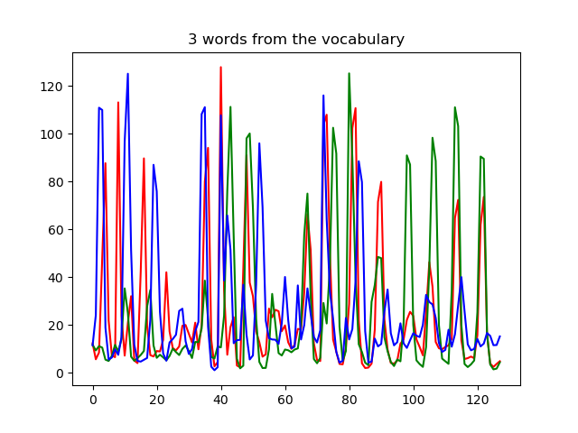

## Place recognition using Bag of Visual Words in C++

---

### Dependencies

- CMake > 3.18
- OpenCV == 4.5.1

### Pull third party submodules

```
$ cd <repo_root>
$ git submodule update --init --recursive
```

### Build

```
$ cd <repo_root>
$ mkdir build && cd build
$ cmake ..
$ make
```

### Run tests

```
$ cd <repo_root>/bin
$ ./bovw_place_recognition_test 
```

### Run building BOVW vocabulary
```
$ cd <repo_root>/bin
$ ./02_compute_vocab 
Converting full dataset...
Image path: "../data/freiburg-full/images"
Processed count: 692
Loaded descriptor: 692
Dict vocabulary: 
Rows: 1000
Cols: 128
```

### Visualizing BOVW vocabulary
```
$ cd <repo_root>/bin
$ ./03_plot_vocab 
Loaded vocabulary: Rows[1000] Cols[128]
```
