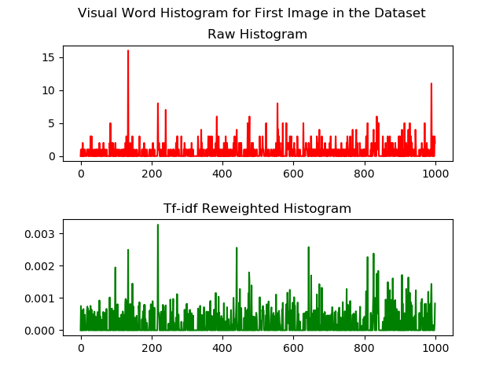

## Place recognition using Bag of Visual Words in C++

---

### Dependencies

- CMake > 3.18
- OpenCV == 4.5.1

### Pull third party submodules

```
$ cd <repo_root>
$ git submodule update --init --recursive
```

### Build

```
$ cd <repo_root>
$ mkdir build && cd build
$ cmake ..
$ make
```

### Run tests

```
$ cd <repo_root>/bin
$ ./bovw_place_recognition_test 
```

### Visualizing SIFT keypoints in dataset images
```
$ cd <repo_root>/bin
$ ./01-visualizing_sift_keypoints 

Testing SIFT
Saved image to ../images/scene_sift_000.png
Saved image to ../images/scene_sift_300.png
Saved image to ../images/scene_sift_700.png

```


### Generating BOVW vocabulary

- Building the vocabulary dictionary with parameter `KMEANS_MAX_ITER` = 30, `KMEANS_DICT_SIZE` = 1000.
- These parameters can be modified in <a href='./src/02-compute_vocab.cpp'>02-compute_vocab.cpp</a>.

    ```
    $ cd <repo_root>/bin
    $ ./02_compute_vocab 
    Converting full dataset...
    Image path: "../data/freiburg-full/images"
    Processed count: 692
    Loaded descriptor: 692
    Dict vocabulary: 
    Rows: 1000
    Cols: 128
    ```

### Visualizing BOVW vocabulary
```
$ cd <repo_root>/bin
$ ./03_plot_vocab 
Loaded vocabulary: Rows[1000] Cols[128]
```


### Generating BOVW histogram
```
$ cd <repo_root>/bin
$ ./04_compute_histogram 
Loading vocabulary
Loaded vocabulary: Rows[1000] Cols[128]

Extracting raw visual word histogram from dataset...
Raw histogram size size: rows[692] cols[1000]

Performing tf-idf reweighting...
Tfidf histogram: rows[692] cols[1000]
Tfidf multiplier: rows[1] cols[1000]

Saving serialized file...
hist_tfidf saved to ../data/tfidf_hist_full.bin
multiplier_tfidf saved to ../data/tfidf_multiplier_full.bin

Visualizing histogram...
First image path: ../data/freiburg-full/bin/imageCompressedCam0_0003730.bin
```
**Selected image for visualization of BOVW histogram:**




### Running the complete solution

- Execute the binary with image path as first argument, and pipe the output to an html file.

    ```shell
    $ cd <repo_root>/bin
    $ ./05-complete_search_solution ../data/freiburg/images/imageCompressedCam0_0000000.png > ../web_app/output.html
    ```

- Open the html with a web browser.

### Results

1. **Input image:** `imageCompressedCam0_0000000.png`

    

    **Output:**

    

2. **Input image:** `imageCompressedCam0_0000300.png`

    

    **Output:**

    

3. **Input image:** `imageCompressedCam0_0000700.png`

    

    **Output:**

    

4. **Input image:** `imageCompressedCam0_0003730.png`

    

    **Output:**

    